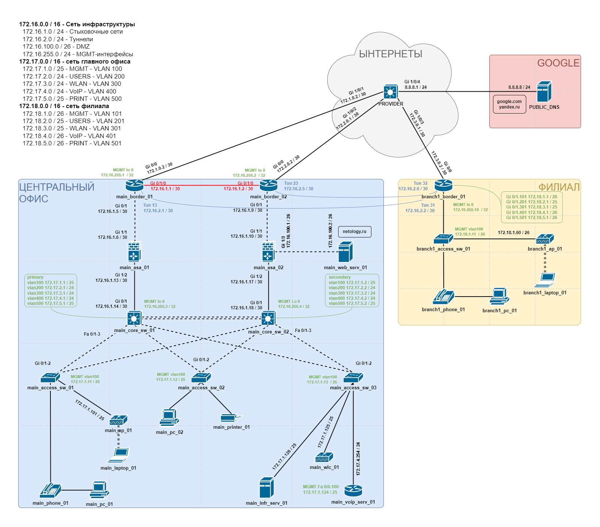

#  НЕТОЛОГИЯ 22-23

## Дипломная работа профессии "Сетевой инженер"

### Содержание

- [Задание](#Задание)
- [Файл проекта](#Файл-проекта)
- [Графическая схема](#Графическая-схема)
- [План сети](#План-сети)
- [Конфигурационные файлы](#Конфигурационные-файлы)
- [Пояснительная записка](#Пояснительная-записка)
- [Тестирование](#Тестирование)

---

### Задание

Задание к проекту можно найти в [репозитории](https://github.com/netology-code/ntw-diplom/blob/main/README.md) Нетологии.

---

### Файл проекта

[PKR-файл](cpt/ntw-diplom.pkt) проекта.

> [!NOTE]
> Логин и пароль для подключения к консоли:  
> *admin*  
> *passwd*  
> 
> Логин и пароль для подключения по SSH:  
> *tacasc*  
> *passwd*  
> 
> Пароль для перехода в привилегированный режим:  
> *passwd*  

---

### Графическая схема

Итоговая графическая схема проекта, с планом сети:

---

### План сети

План сети для проекта в табличном виде:
- [Таблица подсетей](tables/subnets.md).
- [Сводная таблица по интерфейсам](tables/interfaces.md).

---

### Конфигурационные файлы

Список конфигурационных файлов (и комманд к ним):
- [main_access_sw_01](source/configs_txt/01-main_access_sw_01_startup-config.txt)  [(комманды)](source/commands_txt/01-main_access_sw_01.txt) .
- [main_access_sw_02](source/configs_txt/02-main_access_sw_02_startup-config.txt)  [(комманды)](source/commands_txt/02-main_access_sw_02.txt) .
- [main_access_sw_03](source/configs_txt/03-main_access_sw_03_startup-config.txt)  [(комманды)](source/commands_txt/03-main_access_sw_03.txt) .
- [main_core_sw_01](source/configs_txt/04-main_core_sw_01_startup-config.txt)  [(комманды)](source/commands_txt/04-main_core_sw_01.txt) .
- [main_core_sw_02](source/configs_txt/05-main_core_sw_02_startup-config.txt)  [(комманды)](source/commands_txt/05-main_core_sw_02.txt) .
- [main_voip_serv_01](source/configs_txt/06-main_voip_serv_01_startup-config.txt)  [(комманды)](source/commands_txt/06-main_voip_serv_01.txt) .
- [main-asa-01](source/configs_txt/07-main-asa-01_startup-config.txt)  [(комманды)](source/commands_txt/07-main_asa_01.txt) .
- [main-asa-02](source/configs_txt/08-main-asa-02_startup-config.txt)  [(комманды)](source/commands_txt/08-main_asa_02.txt) .
- [main_border_01](source/configs_txt/09-main_border_01_startup-config.txt)  [(комманды)](source/commands_txt/09-main_border_01.txt) .
- [main_border_02](source/configs_txt/10-main_border_02_startup-config.txt)  [(комманды)](source/commands_txt/10-main_border_02.txt) .
- [branch1_border_01](source/configs_txt/11-branch1_border_01_startup-config.txt)  [(комманды)](source/commands_txt/11-branch1_border_01.txt) .
- [branch1_access_sw_01](source/configs_txt/12-branch1_access_sw_01_startup-config.txt)  [(комманды)](source/commands_txt/12-branch1_access_sw_01.txt) .
- [PROVIDER](source/configs_txt/13-PROVIDER_startup-config.txt)  [(комманды)](source/commands_txt/13-PROVIDER.txt) .

Также конфигурация через GUI:
- [main_infr_serv_01_DHCP](source/configs_gui/01-main_infr_serv_01_DHCP.png).
- [main_infr_serv_01_DNS](source/configs_gui/02-main_infr_serv_01_DNS.png).
- [main_infr_serv_01_AAA](source/configs_gui/03-main_infr_serv_01_AAA.png).
- [main_infr_serv_01_SYSLOG](source/configs_gui/04-main_infr_serv_01_SYSLOG.png).
- [main_infr_serv_01_NTP](source/configs_gui/05-main_infr_serv_01_NTP.png).
- [main_wlc_01_MAIN_WIFI](source/configs_gui/06-main_wlc_01_MAIN_WIFI.png).
- [main_wlc_01_BRANCH1_WIFI](source/configs_gui/07-main_wlc_01_BRANCH1_WIFI.png).
- [main_wlc_01_MAIN_AP](source/configs_gui/08-main_wlc_01_MAIN_AP.png).
- [main_wlc_01_BRANCH1_AP](source/configs_gui/09-main_wlc_01_BRANCH1_AP.png).
- [PUBLIC_DNS](source/configs_gui/10-PUBLIC_DNS.png).

---

### Пояснительная записка

[Пояснение](https://github.com/mkAdmin11/crpnt-final/tree/main/explanation#НЕТОЛОГИЯ-22-23) к проекту.

---

### Тестирование

[Тестирование](https://github.com/mkAdmin11/crpnt-final/tree/main/testing#НЕТОЛОГИЯ-22-23), выполненое по [требованиям](https://github.com/netology-code/ntw-diplom/blob/main#тестирование) к проекту.
