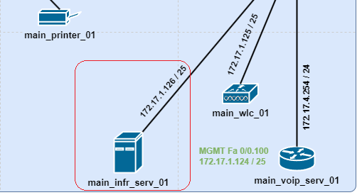

#  НЕТОЛОГИЯ

### Дипломная работа профессии "Сетевой инженер"

- [Задание](#Задание)
- [Графическая схема](#Графическая-схема)
- [План сети](#План-сети)
- [Конфиги](#Конфиги)
- [Пояснительная записка](#Пояснительная-записка)

---

### Задание

Задание можно посмотреть по [ссылке](https://github.com/netology-code/ntw-diplom/blob/main/README.md), в репозитории Нетологии.

---

### Графическая схема

Итоговая графическая схема, которая реализована, с планом сети:

---

### План сети

План сети в табличном виде:
- [Таблица подсетей](source/subnets.md).
- [Сводная таблица по интерфейсам](source/interfaces.md).

---

### Конфиги

Список конфигурационных файлов:
- [01_main_infr_serv_01_DHCP](configs/01_main_infr_serv_01_DHCP.png).
- [02_main_infr_serv_01_DNS](configs/02_main_infr_serv_01_DNS.png).
- [03_main_infr_serv_01_AAA](configs/03_main_infr_serv_01_AAA.png).
- [04_main_infr_serv_01_SYSLOG](configs/04_main_infr_serv_01_SYSLOG.png).
- [05_main_infr_serv_01_NTP](configs/05_main_infr_serv_01_NTP.png).
- [06_main_wlc_01_MAIN_WIFI](configs/06_main_wlc_01_MAIN_WIFI.png).
- [07_main_wlc_01_BRANCH1_WIFI](configs/07_main_wlc_01_BRANCH1_WIFI.png).
- [08_main_wlc_01_MAIN_AP](configs/08_main_wlc_01_MAIN_AP.png).
- [09_main_wlc_01_BRANCH1_AP](configs/09_main_wlc_01_BRANCH1_AP.png).
- [10_PUBLIC_DNS](configs/10_PUBLIC_DNS.png).
- [11_main_access_sw_01_startup-config](configs/11_main_access_sw_01_startup-config).
- [12_main_access_sw_02_startup-config](configs/12_main_access_sw_02_startup-config).
- [13_main_access_sw_03_startup-config](configs/13_main_access_sw_03_startup-config).
- [14_main_core_sw_01_startup-config](configs/14_main_core_sw_01_startup-config).
- [15_main_core_sw_02_startup-config.](configs/15_main_core_sw_02_startup-config).
- [16_main-asa-01_startup-config](configs/16_main-asa-01_startup-config).
- [17_main-asa-02_startup-config](configs/17_main-asa-02_startup-config).
- [18_main_border_01_startup-config](configs/18_main_border_01_startup-config).
- [19_main_border_02_startup-config](configs/19_main_border_02_startup-config).
- [20_branch1_border_01_startup-config](configs/20_branch1_border_01_startup-config).
- [21_branch1_access_sw_01_startup-config](configs/21_branch1_access_sw_01_startup-config).
- [22_PROVIDER_startup-config](configs/22_PROVIDER_startup-config).

---

### Пояснительная записка

#### Инфраструктурный сервер

**DHCP**  
DHCP-сервер который раздает IP адреса каждому устройству, подключенному в локальную сеть.
Тут отмечу что все устройства получают в качестве настроек приватный DNS, только абоненты гостевого WI-Fi получают публичный DNS.

**DNS**  
Имеет две A-записи:
- netology.ru - наш  веб сервер.
- public-dns.com - публичный DNS.
Две NS-записи для доменов .ru и .com, ссылаются на публичный DNS.

Пользователи из внутренней сети пользуются приватным DNS и netology.ru у них разрешается из внутренней сети - 172.16.100.2.
Исключение пользователи гостевого Wi-Fi, они пользуются публичным DNS, и имя netology.ru у них резолвится как наш публичный адрес - 172.1.0.2. Далее работает проброс портов.

**SYSLOG**  
Syslog-коллектор, получает и хранит логи со всех АСО.

**AAA**  
AAA-сервер, хранил логин/пароль для:
абонентов гостевого Wi-Fi - radius.
подключения администратора к АСО по SSH - tacasc+.

**NTP**  
NTP-сервер, АСО настроено обращаться к нему, для синхронизации времени.
Крайне криво работает, надо постоянно тыркать, включать-выключать, чтобы АСО начало с ним обновляться, поэтому верификация не настраивалась.

**SSH**  
Является рабочим местом администратора, АСО настроено так, что только с него можно подключиться к консоли по SSH.

#### WLAN контроллер

