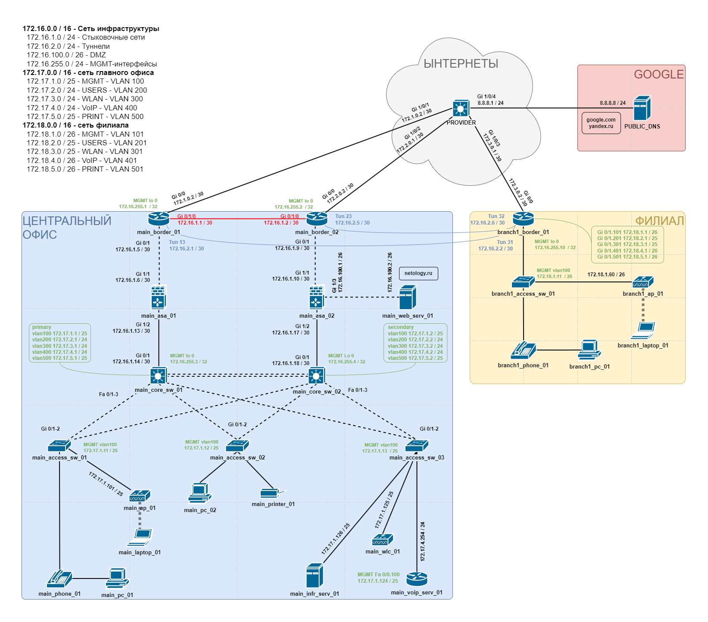

# НЕТОЛОГИЯ
Дипломная работа профессии "Сетевой инженер"

- [Задание](#title1)
- [Схема](#title2)

---

## <a id="title1">Задание</a>

Задание можно посмотреть по [ссылке](https://github.com/netology-code/ntw-diplom/blob/main/README.md), в репозитории Нетологии.

---

## <a id="title2">Схема</a>

Итоговая схема, которая реализована, с планом сети:

---

<table>
    <tr>
        <th>  </th>
        <th> Удаленный узел   Интерфейс   Адрес/Маска </th>
        <th> Удаленный узел   Интерфейс   Адрес/Маска </th>
        <th> Удаленный узел   Интерфейс   Адрес/Маска </th>
        <th> Удаленный узел   Интерфейс   Адрес/Маска </th>
        <th> Удаленный узел   Интерфейс   Адрес/Маска </th>
        <th> Удаленный узел   Интерфейс   Адрес/Маска </th>
        <th> Удаленный узел   Интерфейс   Адрес/Маска </th>
        <th> Удаленный узел   Интерфейс   Адрес/Маска </th>
        <th> Удаленный узел   Интерфейс   Адрес/Маска </th>
        <th> AS </th>
    </tr>
    <tr>
        <td> main_border_01 </td>
    </tr>
    <tr>
        <td> main_border_02 </td>
    </tr>
    <tr>
        <td> main_asa_01 </td>
    </tr>
    <tr>
        <td> main_asa_02 </td>
    </tr>
    <tr>
        <td> main_web_server_01 </td>
    </tr>
    <tr>
        <td> main_core_sw_01 </td>
    </tr>
    <tr>
        <td> main_core_sw_02 </td>
    </tr>
    <tr>
        <td> main_access_sw_01 </td>
    </tr>
    <tr>
        <td> main_access_sw_02 </td>
    </tr>
    <tr>
        <td> main_access_sw_03 </td>
    </tr>
    <tr>
        <td> main_ap_01 </td>
    </tr>
    <tr>
        <td> main_voip_serv_01 </td>
    </tr>
    <tr>
        <td> main_wlc_01 </td>
    </tr>
    <tr>
        <td> main_infra_serv_01 </td>
    </tr>
    <tr>
        <td> PROVIDER </td>
    </tr>
    <tr>
        <td> google </td>
    </tr>
    <tr>
        <td> branch1_border_01 </td>
    </tr>
    <tr>
        <td> branch1_access_sw_01 </td>
    </tr>
    <tr>
        <td> branch1_ap_01 </td>
    </tr>
</table>

| Заголовок       |
|-----------------|
| Линия 1         |
| Линия 2         |
| Линия 1         |
| Линия 2         |
| Линия 1         |
| Линия 2         |
