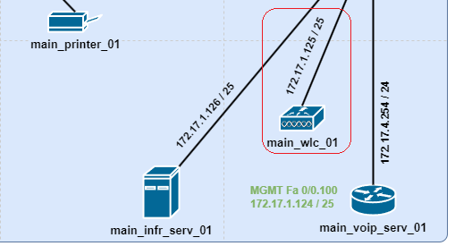
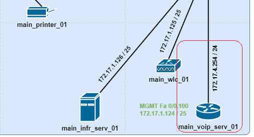
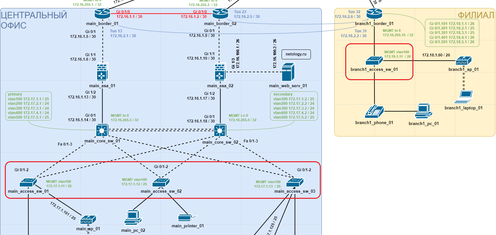
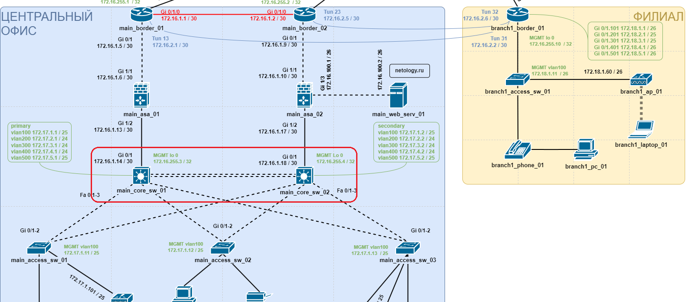

# Дипломная работа профессии "Сетевой инженер"

### Пояснительная записка

- [Инфраструктурный сервер](#Инфраструктурный-сервер)
- [WLAN контроллер](#WLAN-контроллер)
- [Сервер телефонии](#Сервер-телефонии)
- [Уровень доступа](#Уровень-доступа)
- [Уровень ядра](#Уровень-ядра)

---

### Инфраструктурный сервер

***DHCP***  
DHCP-сервер который раздает IP адреса каждому устройству, подключенному в локальную сеть.
Тут отмечу что все устройства получают в качестве настроек приватный DNS, только абоненты гостевого WI-Fi получают публичный DNS.

***DNS***  
Имеет две A-записи:
- netology.ru - наш  веб сервер.
- public-dns.com - публичный DNS.
Две NS-записи для доменов .ru и .com, ссылаются на публичный DNS.

Пользователи из внутренней сети пользуются приватным DNS и netology.ru у них разрешается из внутренней сети - 172.16.100.2.
Исключение пользователи гостевого Wi-Fi, они пользуются публичным DNS, и имя netology.ru у них резолвится как наш публичный адрес - 172.1.0.2. Далее работает проброс портов.

***SYSLOG***  
Syslog-коллектор, получает и хранит логи со всех АСО.

***AAA***  
AAA-сервер, хранил логин/пароль для:
абонентов гостевого Wi-Fi - radius.
подключения администратора к АСО по SSH - tacasc+.

***NTP***  
NTP-сервер, АСО настроено обращаться к нему, для синхронизации времени.
Крайне криво работает, надо постоянно тыркать, включать-выключать, чтобы АСО начало с ним обновляться, поэтому верификация не настраивалась.

***SSH***  
Является рабочим местом администратора, АСО настроено так, что только с него можно подключиться к консоли по SSH.

---

### WLAN контроллер

По заданию надо было использовать WLC-2504, но т.к. он не умеет работать с VLAN, использовался WLC-PT.

Настроен SID для главного офиса и для филиала, с указанием каким VLAN тегировать трафик. За логином и паролем обращается к AAA-серверу.

И настроены AP-группы, точка доступа в главном офисе раздает свой SID, точка доступа в филиале раздает SID для филиала.

---

### Сервер телефонии

VoIP шлюз реализованный на маршрутизаторе Cisco 2811 посредством SCCP.

Настроено два профиля для телефона в центральном офисе и филиале.

---

### Уровень доступа

***Базовые настройки***  
Настроены timezone и связь с ntp-сервером.  
Настроен сервер для резолва имен.  
Настроена отправка SYSLOG на сервер.  
Настроен шлюз по умолчанию.  
Неиспользуемые порты выключены.  

***Подключение***  
Настроены линейные интерфейсы.  
Настроен SSH, к VLAN интерфейсу с рабочего места администратора.  
Как и на всем АСО настроена AAA модель. Локальный пользователь для подключения к консоли, tacasc+ для подключения по SSH.  

***STP***  
Настроен rapid-pvst для всех VLAN.  
Приоритет одинаковый у всех коммутаторов доступа, но ниже чем у коммутаторов ядра. Аплинк в сторону резервного коммутатора ядра с увеличенной стоимостью, чтобы блокировался, когда основной коммутатор ядра работает.  
Порты для подключения оконечного оборудования в режиме portfast, чтобы не участвовали в построении STP, и bpduguard чтобы не получать BPDU.  

***DHCP snooping***  
Настроен dhcp snooping для для всех VLAN.  
Указаны порты с которых можно принимать dhcp-дейтаграммы. Ну и ввиду ограниченного функционала CPT allow-untrusted для 82 опции.  

***Port security***  
На интерфейсах включен для подключения оконечного оборудования режим port-security в режиме изучения до 2-х MAC адресов и блокировки и оповещения при нарушении.  
По заданию требуется изучать только до 2-х MAC адресов. Но в случае подключения телефона и компьютера мостом, приходится увеличить до трех, т.к. у телефона уже будет два MAC-адресам.  
Ну и для Wi-Fi без ограничений, думаю не предполагается ограничивать количество абонентов гостевого Wi-Fi.  

---

### Уровень ядра

***Базовые настройки***  
Настроены timezone и связь с ntp-сервером.  
Настроен сервер для резолва имен.  
Настроена отправка SYSLOG на сервер.  
Неиспользуемые порты выключены.  

***Ответ на вопрос***  
Касательно возможности подключения 5 дополнительных коммутаторов доступа, проблем с этим нет, у коммутаторов ядра еще 18 свободных портов.  

***Подключение***
Настроены линейные интерфейсы.  
Настроен SSH, к loopback интерфейсу с рабочего места администратора.  
Как и на всем АСО настроена AAA модель. Локальный пользователь для подключения к консоли, tacasc+ для подключения по SSH.  

***STP***  
Настроен rapid-pvst для всех VLAN.  
Primary приоритет у основного коммутатора и secondary у резервного.  

***DHCP snooping***  
Настроен dhcp snooping для для всех VLAN.  
Указаны порты, с которых можно принимать dhcp-дейтаграммы. Ну и ввиду ограниченного функционала CPT allow-untrusted для 82 опции.  

***SVI***  
Настроены VLAN интерфейсы:  
Настроено резервирование шлюза по-умолчанию по протоколу HSRP, приоритет для основного коммутатора с мониторингом аплинка и “вытеснением”.  
настроен helper для отправки dhcp-запросов на инфраструктурный сервер.  
Настроены ACL согласно таблице.  

***LACP***  
Два горизонтальных канала объеденены в L2 агрегированных канала по протоколу LACP, на основном коммутаторе в режиме active.  

***OSPF***  
На коммутаторах ядра включена маршрутизация.  
Настроен процесс динамической маршрутизации OSPF. Коммутаторы ядра в тупиковой зоне, точнее nssa, т.е. они видят маршруты анонсированные в своей зоне и от BDR они получают маршрут по умолчанию.  
На коммутаторах ядра анонсируются маршруты до сетей центрального офиса и до MGMT интерфейсов, все пассивные интерфейсы, можно было бы заниматься ре-дистрибуцией.  
Для горизонтальной связи коммутаторов добавлен отдельный VLAN интерфейс, чтобы не расширять ACL для VLAN которые должны быть по заданию.  
