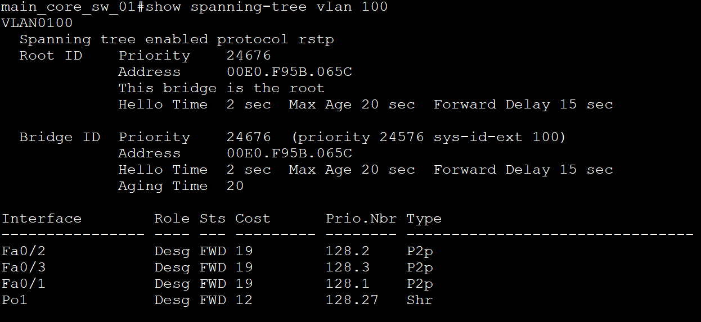
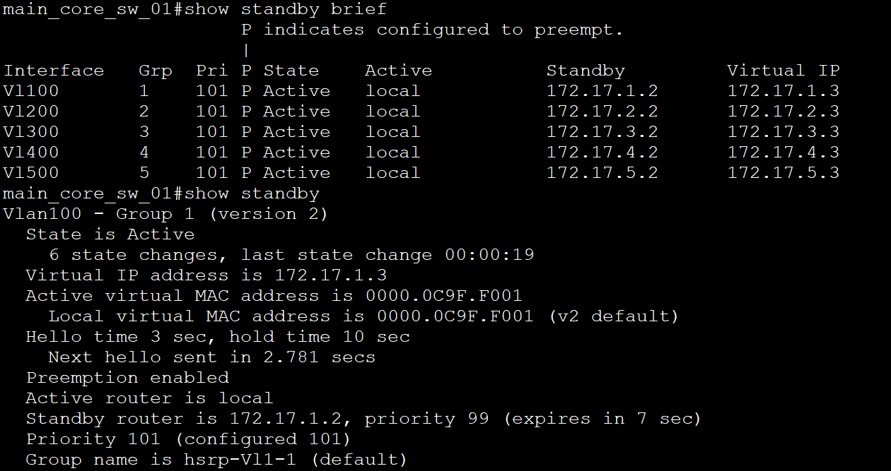

# Дипломная работа профессии "Сетевой инженер"

### Тестирование

- [Проверка STP, HSRP](#Проверка-STP-HSRP)

---

### Проверка STP, HSRP

Роль Root bridge и HSRP-active на одном устройстве. Команды: show spanning-tree, show standby на этом устройстве.

> Скриншоты для VLAN 100, для остальных VLAN результат аналогичный, т.к. настройки идентичные. Вывод с main_core_sw_01.

---
