# НЕТОЛОГИЯ 22-23

## Дипломная работа профессии "Сетевой инженер"

### Тестирование

- [STP](#STP)
- [Маршрутизация на коммутаторах ядра](#Маршрутизация-на-коммутаторах-ядра)
- [LAG](#LAG)
- [Маршрутизация на бордерах](#Маршрутизация-на-бордерах)
- [БЛВС](#БЛВС)
- [VoIP](#VoIP)
- [AAA](#AAA)
- [NTP](#NTP)

---

### STP

Проверка STP, HSRP. Роль Root bridge и HSRP-active на одном устройстве. Команды: show spanning-tree, show standby на этом устройстве.

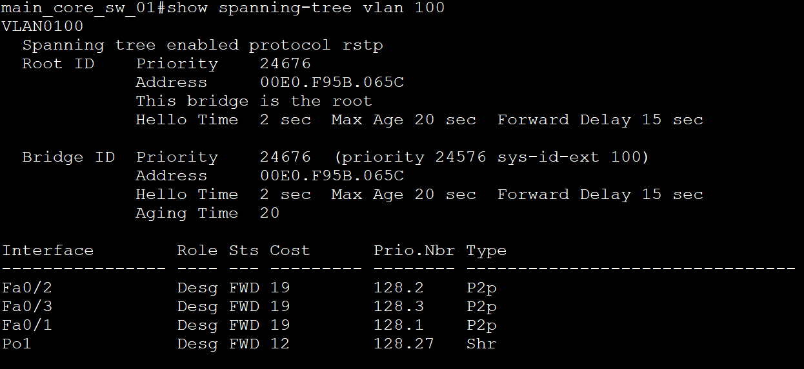
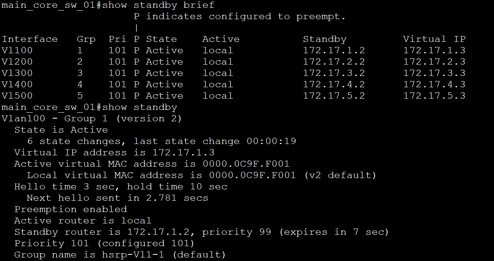

> Скриншоты для VLAN 100, для остальных VLAN результат аналогичный, т.к. настройки идентичные. Вывод с main_core_sw_01.

---

### Маршрутизация на коммутаторах ядра

Проверка маршрутизации на коммутаторах ядра. Show ip route. Должен присутствовать маршрут по-умолчанию и маршруты до интерфейсов ASA и бордеров.

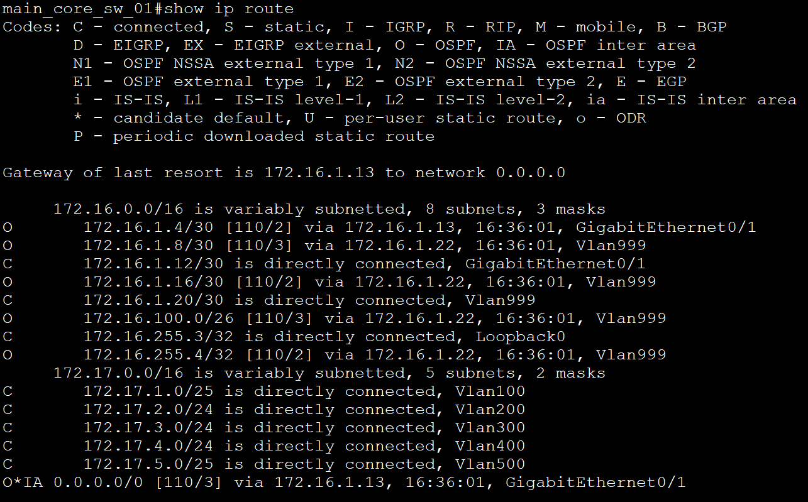

> Вывод с main_core_sw_01.

---

### LAG

Проверка LAG на бордерах show etherchannel summary.

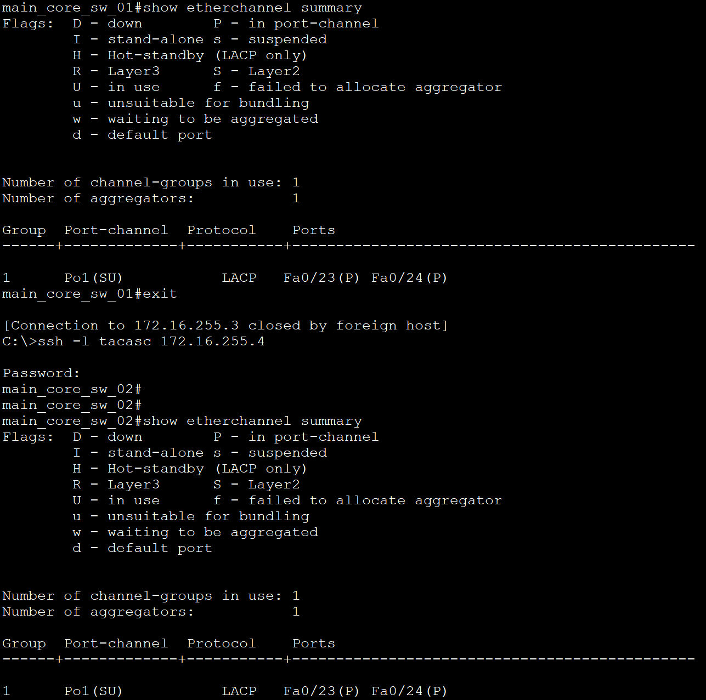

> Видимо имелись ввиду коммутаторы ядра, а не бордеры. Вывод с main_core_sw_01 и main_core_sw_02.

---

### Маршрутизация на бордерах

Маршрутизация на бордерах sh ip route. В таблице маршрутизации должны присутствовать bgp-маршруты от провайдера, ospf-маршруты до внутренних подсетей ЦО и филиала.

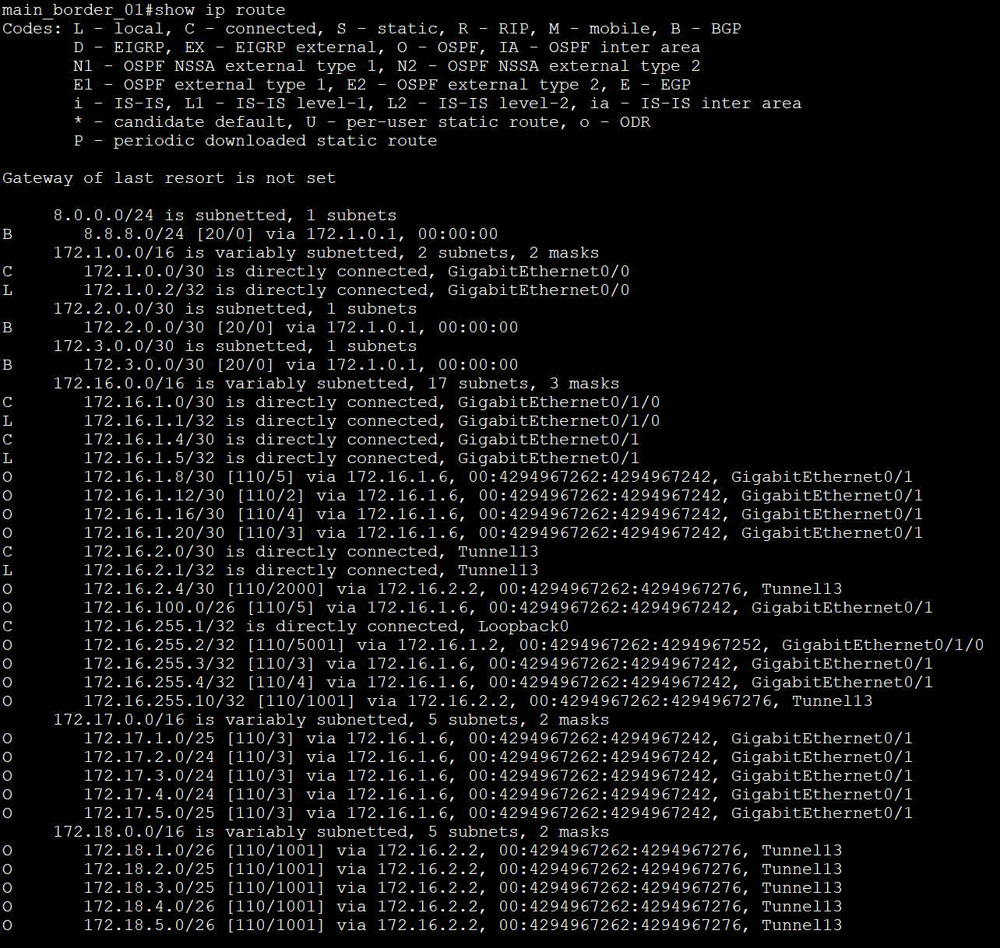

> Вывод с main_border_01.

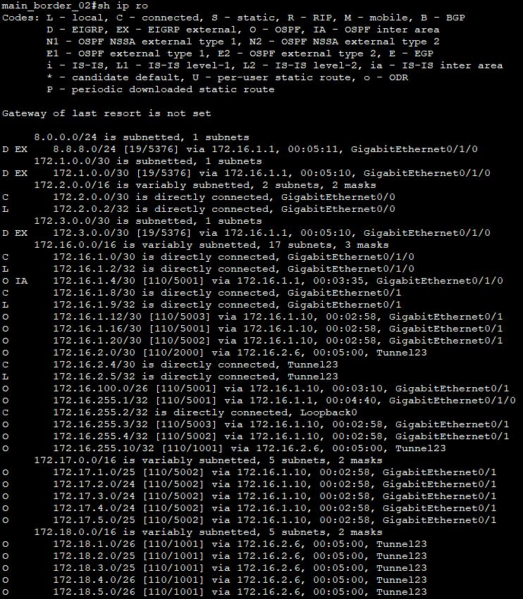

> Вывод с main_border_02 если основной канал работает.

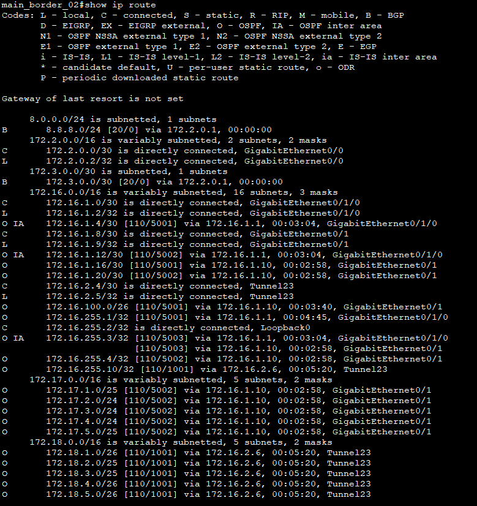

> Вывод с main_border_02 если основной канал упал.  
> Я настраивал все так, что пока основной канал работает весь трафик в интернет идет через него. Я конечно понимаю, что было бы здорово делать всё рамках одного OSPF процесса, но при любых манипуляциях тоннели постоянно падает и поднимается.  
> Так что для разнообразия использовал EIGRP. Сделать такую балансировку в OSPF процессе, для трафика в сторону филиала сделать не получается.

---

### БЛВС

Туннель CAPWAP на БЛВС ТД в статусе Connected, с ноутбуков есть связь с 8.8.8.8.

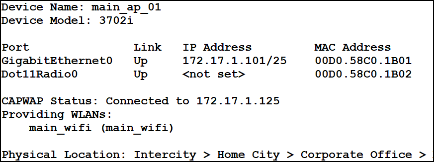
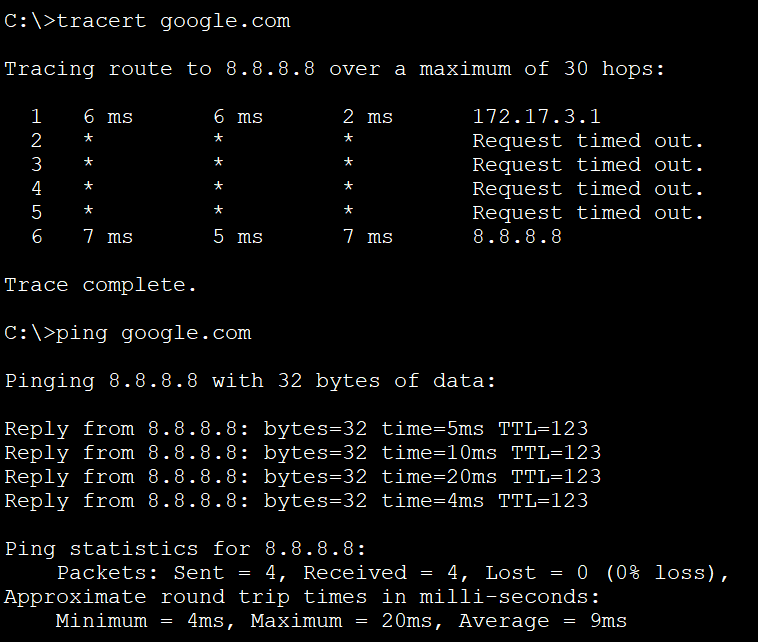

> Вывод с main_ap_01 и main_laptop_01. Трассировка чтобы показать шлюз.

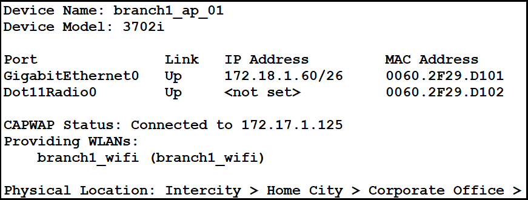
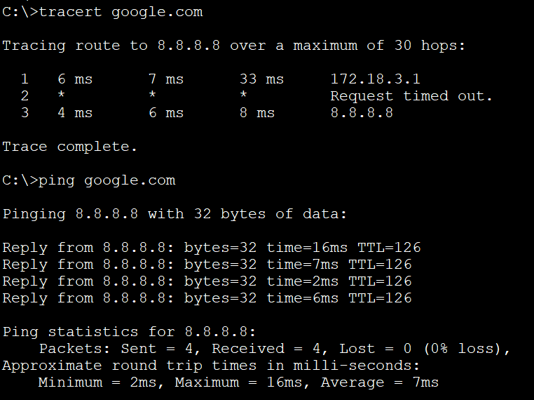

> Вывод с branch1_ap_01 и branch1_laptop_01. Трассировка чтобы показать шлюз.

---

### VoIP

Телефонные аппараты зарегистрированы на VoIP сервере, прозвон с одного на другой работает.

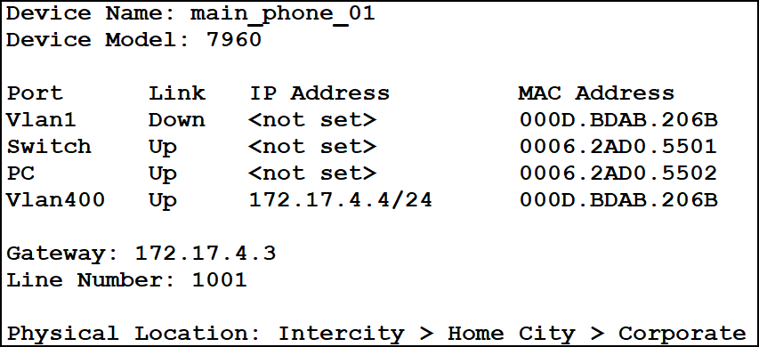

> Вывод с main_phone_01.

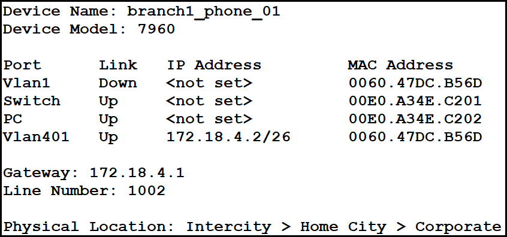
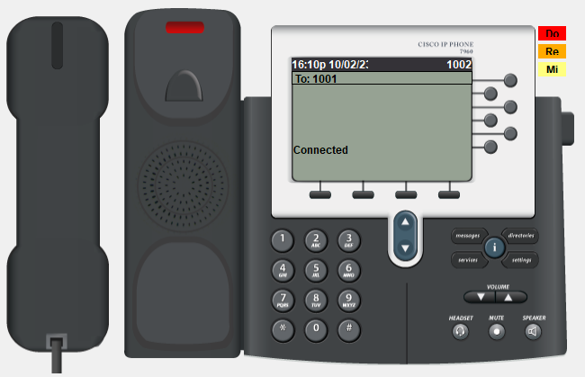

> Вывод с branch1_phone_01.

---

### AAA

На все сетевые устройства можно попасть по учётной записи tacacs+ сервера.

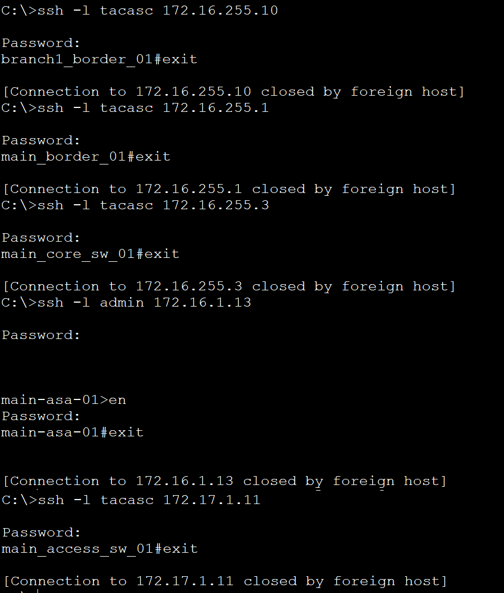

> Настроено подключение с main_infr_serv_01 (т.с. рабочее место администратора).
> Подключение к бордеру филиала, к бордеру ЦО, к коммутатору ядра, с коммутатору доступа.
> К ASA подключение к физическому интерфейсу (т.к. отсутствует loopback interface) и по локальной учетной записи (т.к. отсутствует возможность на ASA использовать tacasc).

---

### NTP

Время на устройствах синхронизировано. Show ntp status.

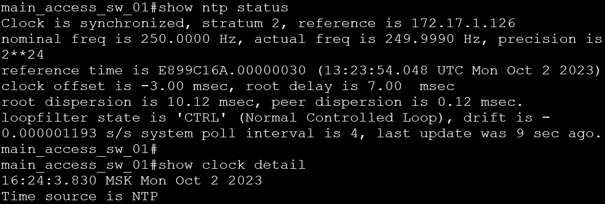
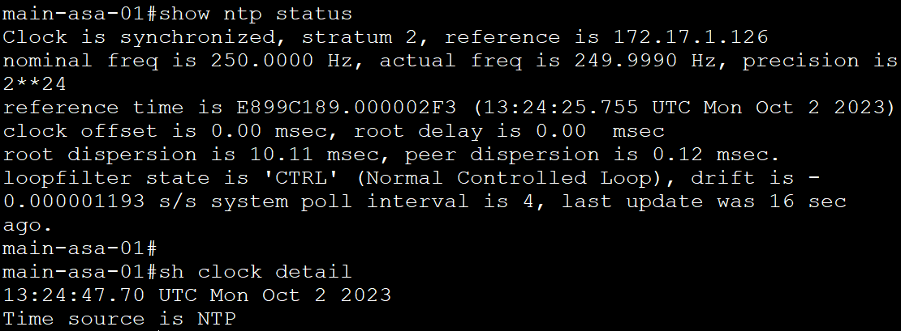
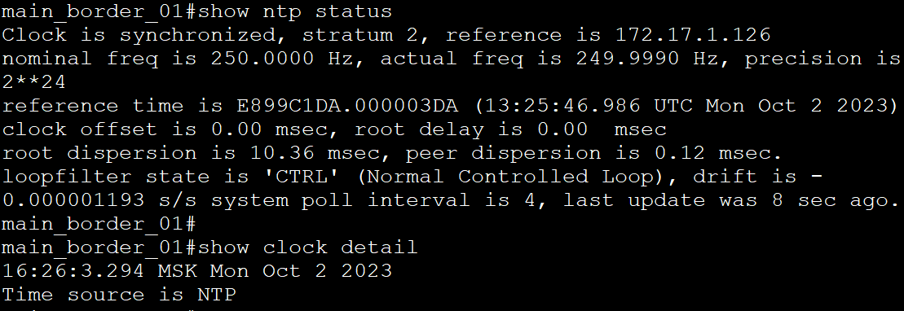
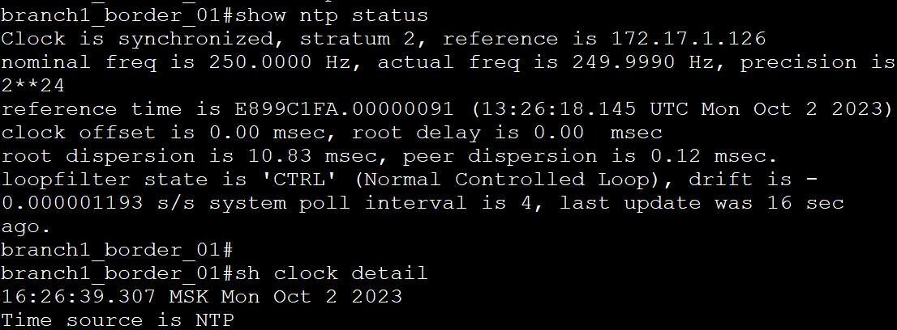

> Вывод с main_access_sw_01, main-asa-01, main_border_01 и branch1_border_01.
> Стоит отметить что NTP работает крайне криво, и после перезагрузки симуляции или открытия проекта, его постоянно надо выключать-включать, тыркать время и с десятого раза все заработает, поэтому не ставил ключа для верификации. Бывает, что show ntp status сообщает что время успешно синхронизировано, но само время не обновляется.

