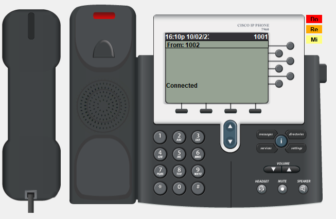
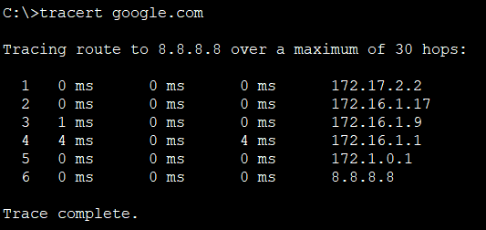

# НЕТОЛОГИЯ 22-23

## Дипломная работа профессии "Сетевой инженер"

### Тестирование

- [STP](#STP)
- [Маршрутизация на коммутаторах ядра](#Маршрутизация-на-коммутаторах-ядра)
- [LAG](#LAG)
- [Маршрутизация на бордерах](#Маршрутизация-на-бордерах)
- [БЛВС](#БЛВС)
- [VoIP](#VoIP)
- [AAA](#AAA)
- [NTP](#NTP)
- [WEB-DMZ](#WEB-DMZ)
- [Отказоустойчивость доступа в интернет](#Отказоустойчивость-доступа-в-интернет)
- [Отказоустойчивость core-fw-border](#Отказоустойчивость-core-fw-border)
- [ACL для БЛВС main-офиса](#ACL-для-БЛВС-main-офиса)
- [ACL для БЛВС филиала](#ACL-для-БЛВС-филиала)

---

### STP

> Проверка STP, HSRP. Роль Root bridge и HSRP-active на одном устройстве. Команды: show spanning-tree, show standby на этом устройстве.

Скриншоты для VLAN 100, для остальных VLAN результат аналогичный, т.к. настройки идентичные.  
Вывод с `main_core_sw_01`.

---

### Маршрутизация на коммутаторах ядра

> Проверка маршрутизации на коммутаторах ядра. Show ip route. Должен присутствовать маршрут по-умолчанию и маршруты до интерфейсов ASA и бордеров.

Вывод с `main_core_sw_01`.

---

### LAG

> Проверка LAG на бордерах show etherchannel summary.

Видимо имелись ввиду коммутаторы ядра, а не бордеры.  
Вывод с `main_core_sw_01` и `main_core_sw_02`.

---

### Маршрутизация на бордерах

> Маршрутизация на бордерах sh ip route. В таблице маршрутизации должны присутствовать bgp-маршруты от провайдера, ospf-маршруты до внутренних подсетей ЦО и филиала.

Вывод с `main_border_01`.

Вывод с `main_border_02` если основной канал работает.

Вывод с `main_border_02` если основной канал упал.  

> [!NOTE]
> Я настраивал все так, что пока основной канал работает весь трафик в интернет идет через него. Я конечно понимаю, что было бы здорово делать всё рамках одного OSPF процесса, но при любых манипуляциях тоннели постоянно падает и поднимается.  
Так что для разнообразия использовал EIGRP.
> Сделать такую балансировку в OSPF процессе, для трафика в сторону филиала сделать не получается.

---

### БЛВС

> Туннель CAPWAP на БЛВС ТД в статусе Connected, с ноутбуков есть связь с 8.8.8.8.

Вывод с `main_ap_01` и `main_laptop_01`.

Вывод с `branch1_ap_01` и `branch1_laptop_01`. 

> [!NOTE]
> Трассировка чтобы показать шлюз.

---

### VoIP

> Телефонные аппараты зарегистрированы на VoIP сервере, прозвон с одного на другой работает.

Вывод с `main_phone_01`.

Вывод с `branch1_phone_01`.

---

### AAA

> На все сетевые устройства можно попасть по учётной записи tacacs+ сервера.

Подключение к `branch1_border_01`, `main_border_01`, `main_core_sw_01`, `main-asa-01` и `main_access_sw_01`.

> [!NOTE]
> Настроено подключение с `main_infr_serv_01` (т.с. рабочее место администратора).

> [!CAUTION]
> К ASA подключение к физическому интерфейсу (т.к. отсутствует loopback interface) и по локальной учетной записи (т.к. отсутствует возможность на ASA использовать tacasc).

---

### NTP

> Время на устройствах синхронизировано. Show ntp status.

Вывод с `main_access_sw_01`, `main-asa-01`, `main_border_01` и `branch1_border_01`.

> [!CAUTION]
> Стоит отметить что NTP работает крайне криво, и после перезагрузки симуляции или открытия проекта, его постоянно надо выключать-включать, тыркать время и с десятого раза все заработает, поэтому не ставил ключа для верификации. Бывает, что show ntp status сообщает что время успешно синхронизировано, но само время не обновляется.

---

### WEB-DMZ

> С 8.8.8.8 есть доступ к web-серверу в DMZ. Обратный доступ тоже есть. Проверять доступ необходимо браузером.

Запрос с `PUBLIC_DNS`.  
Никакой балансировки и дополнительных точек входа нет,  так что веб сервер доступен только по основному каналу связи.

---

### Отказоустойчивость доступа в интернет

> Отключение одного из каналов связи не приводит к потере доступа в интернет с пользовательских ПК(ping до сервера 8.8.8.8).

Трассировка с `main_pc_01` когда основной канал связи работает.

Трассировка с `main_pc_01` когда основной канал связи упал.  

> [!CAUTION]
> Требует перезагрузки симуляции для корректной перестройки маршрутов.

> [!CAUTION]
> Вообще, по заданию, ACL на коммутаторах ядра и ASA не предполагают получение юзерами ICMP со всех адресов, для получения трассировки ACL расширены.

---

### Отказоустойчивость core-fw-border

> Выход из строя одного из коммутаторов ядра, межсетевого экрана или бордер роутера не приводит к потере доступа в интернет с пользовательских ПК(ping до сервера 8.8.8.8). Потеря доступа к web-серверу извне допускается.

Трассировка с `main_pc_01`, трафик изначально идет по пути `main_core_sw_01 > main-asa-01 > main_border_01 > INTERNET`.  
Начинаем последовательно выключать АСО.

Трассировка с `main_pc_01`, при выключеном коммутаторе ядра `main_core_sw_01`.
Трафик идет по пути `main_core_sw_02 > main-asa-02 > main_border_01 > INTERNET`.

Трассировка с `main_pc_01`, при выключенном межсетевом экране `main-asa-01`.  
Трафик идет по пути `main_core_sw_02 > main-asa-02 > main_border_01 > INTERNET`.

Трассировка с `main_pc_01`, при выключенном бордере `main_border_01`.  
Трафик идет по пути `main_core_sw_01 > main_core_sw_02 > main-asa-02 > main_border_02 > INTERNET`.

> [!CAUTION]
> Придется перезагружать симуляцию. 

---

### ACL для БЛВС main-офиса

> Ноутбуки не имеют доступа к внутренним сетям компании(ping svi users, mgmt, printer).

Пинги с `main_laptop_01`, в интернет, в USERS-сеть, в MGMT-сеть.

Пинги с `main_laptop_01`, в интернет, в VOIP-сеть, в PRINTERS-сеть.

---

### ACL для БЛВС филиала

> Устройства филиала имеют доступ только к внутренним сетям компании, не имеют выхода в интернет.

Пинги с `branch1_pc_01`.  
Доступа в интернет нет, доступ к веб серверу имеется (доступ по локальному адресу, имя резолвится с приватного DNS сервера), доступ к принтеру в главном офисе имеется.

Пинги с `branch1_laptop_01`.  
Доступ в интернет есть, доступ к веб серверу имеется (доступ по публичному адресу, имя резолвится с публичного DNS сервера), доступ к принтеру в главном офисе отсутствует (как и ко всей приватной сети).

